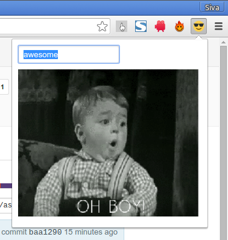

# emogif
### A GIF for every emotion.

Do you want a GIF? All you need to do is open the extension and type
in the search tag. A random GIF will be fetched from GIPHY and its
link will be copied to your clipboard.

#### To install,

1. Download the extension as a [zip file](https://github.com/astronomersiva/emogif/archive/master.zip).
2. Extract its contents in a directory of your choice.
3. Visit [chrome://extensions](chrome://extensions).
4. Verify that the **Developer mode** checkbox is checked.
5. Click on **Load unpacked extension**.
6. Navigate to the directory where the zip file's contents were extracted and click on **Open**.

#### License

MIT © [Sivasubramanyam A](http://sivasubramanyam.me)